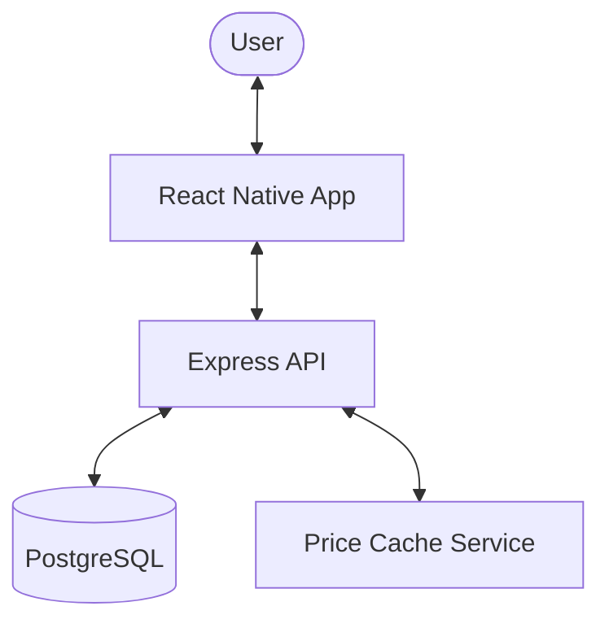

# SimTrader Project Overview

SimTrader is a cryptocurrency trading simulator that allows users to track prices, manage a virtual wallet, and perform simulated buy/sell trades with real-time market data.

## Project Structure

The project is split into two main components:

1.  **Backend (server)**: A Node.js application managing data, authentication, and market data synchronization.
2.  **Frontend (app)**: A React Native mobile application providing the user interface for trading and portfolio management.

## Tech Stack Summary

| Component | Technology |
| :--- | :--- |
| **Backend** | Node.js, Express, TypeScript, Prisma (PostgreSQL), JWT |
| **Frontend** | React Native, TypeScript, React Navigation, Axios, Keychain |
| **Data Sources** | Real-time market data (via internal price cache) |

## High-Level Architecture

